# RocketChat Integration Support for Zentao Webhook

Zentao (community edition only) natively supports integration with a limited number of instant messaging (IM) tools:

- [BearyChat](http://bearychat.com/)
- [DingTalk](https://www.dingtalk.com/)
- [WeCom (WeChat Work)](https://work.weixin.qq.com/)
- [Feishu (Lark)](https://www.feishu.cn/)

If you deploy IM tools in a physically isolated intranet, you either need to pay a high price for private deployment of the above tools (which may not even be available), or deploy other IM tools that can be independently privatized, such as **[RocketChat](https://www.rocket.chat/)** discussed in this article.

Receiving timely notifications about tasks or bugs during development is important. Therefore, integrating Zentao with RocketChat allows important operations in Zentao to be instantly notified in RocketChat.

Since RocketChat supports Webhook integration, we can simply add a RocketChat channel to Zentao's Webhook feature.


## 0. TL;DR

This project is based on Zentao Community Edition 21.7.5's **Webhook** module, adding support for RocketChat Webhook. You can use it directly by backing up the original Webhook directory and replacing it with this project's code. If your Zentao version is different, please modify the code accordingly.


## 1. Development & Testing Environment

For convenience, we use Docker to run both RocketChat and Zentao, using the versions available at the time of writing:

- RocketChat: https://hub.docker.com/r/rocketchat/rocket.chat **7.10.0**
- Zentao: https://hub.docker.com/r/easysoft/zentao **21.7.5**

### 1.1. RocketChat

The `docker-compose.yml` for RocketChat can be found in the official GitHub repo: https://github.com/RocketChat/rocketchat-compose/blob/main/compose.yml  
Documentation: https://docs.rocket.chat/v1/docs/deploy-with-docker-docker-compose  
After running, register and activate via [RocketChat Cloud](https://cloud.rocket.chat/home) as per the docs.

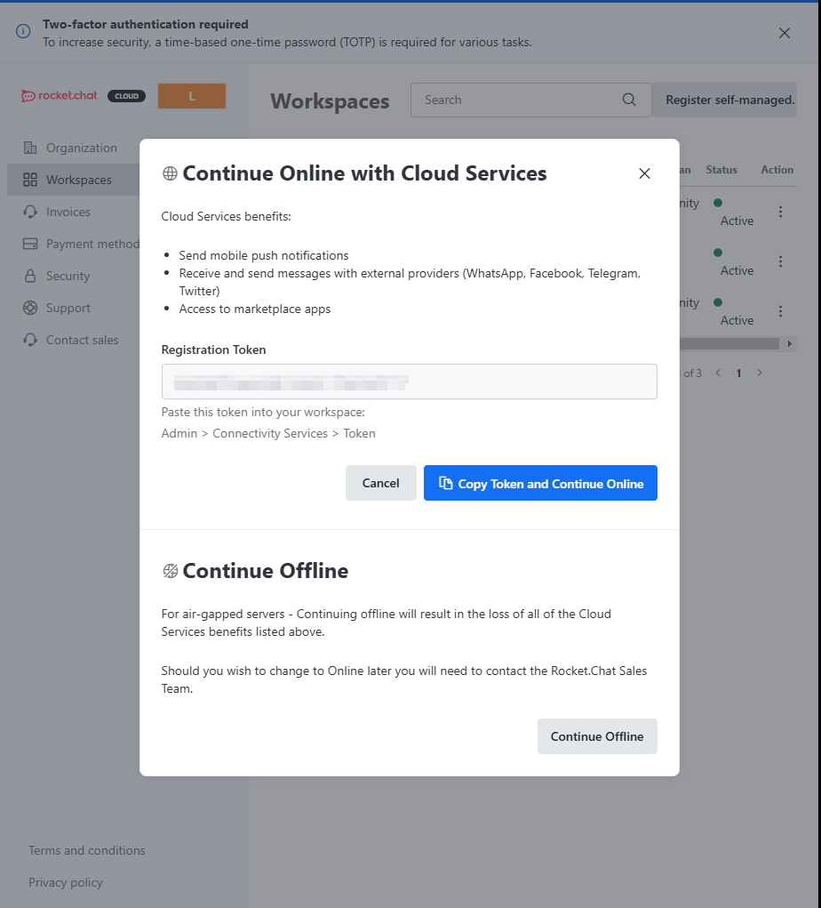

Access the running RocketChat at http://127.0.0.1:3000 :

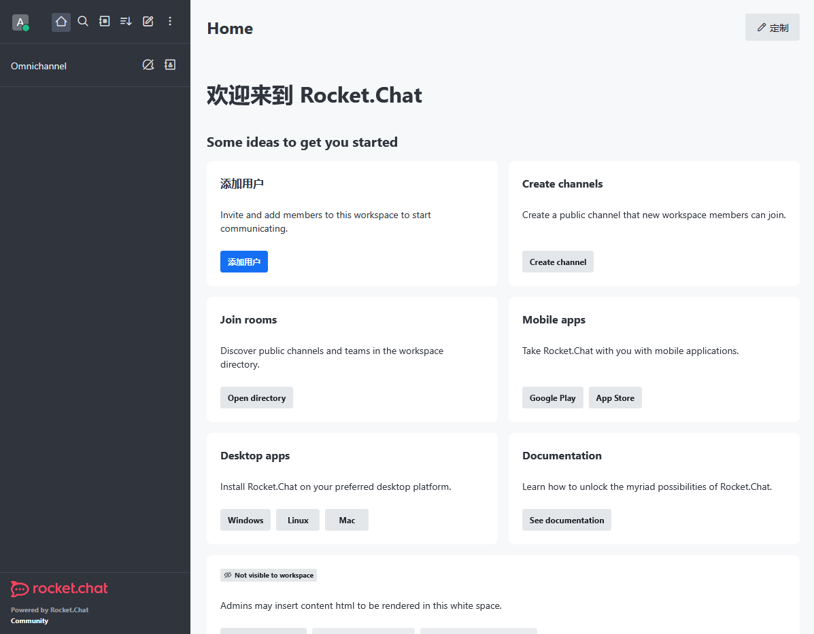

#### Creating a RocketChat Admin

Refer to [official docs](https://github.com/sporqist/Rocket.Chat_docs/blob/main/setup-and-configure/accessing-your-workspace/admin-account-creation.md). Add the following to the `rocketchat` `environment` in `docker-compose.yml`:

```yaml
      INITIAL_USER: yes
      ADMIN_USERNAME: admin
      ADMIN_NAME: Admin
      ADMIN_EMAIL: admin@localhost.com
      ADMIN_PASS: password
```


### 1.2. Zentao

Run Zentao with Docker. Note the use of the `rocketchat_default` bridge network for easy communication between containers:
```bash
docker run -it -d \
    --name zentao \
    -v $PWD/data:/data \
    -p 80:80 \
    -e MYSQL_INTERNAL=true \
	--network rocketchat_default \
    easysoft/zentao:21.7.5
```

After installation, check **Notification Settings** in the admin panel to see supported **Webhooks**:

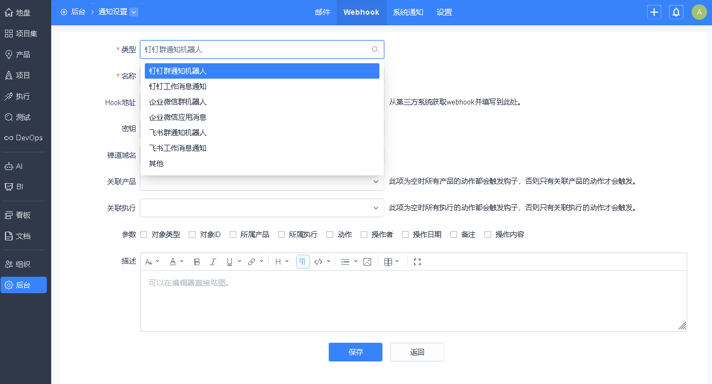

To modify Zentao's Webhook code, obtain the community edition source code:

```bash
git clone --branch zentaopms_21.7.5_20250911 https://github.com/easysoft/zentaopms.git
```

You can then modify and repackage the Docker image, or, more conveniently, copy the webhook module from the container to the host and mount it back:

```bash
# Copy webhook directory to host
docker cp zentao:/apps/zentao/module/webhook ./

# Stop and remove old container
docker stop zentao && docker rm zentao

# Mount webhook directory and start new container
docker run -it -d \
    --name zentao \
    -v $PWD/data:/data \
	-v $PWD/webhook:/apps/zentao/module/webhook \
    -p 80:80 \
    -e MYSQL_INTERNAL=true \
	--network rocketchat_default \
    easysoft/zentao:21.7.5

```

For convenience, the latter method is used here.


## 2. Add Webhook in RocketChat

### Support for Chinese User and Channel Names

Go to **Administration** >> **General** >> **UTF8** and set:

```
[\u4e00-\u9fa50-9a-zA-Z-_.]+
```

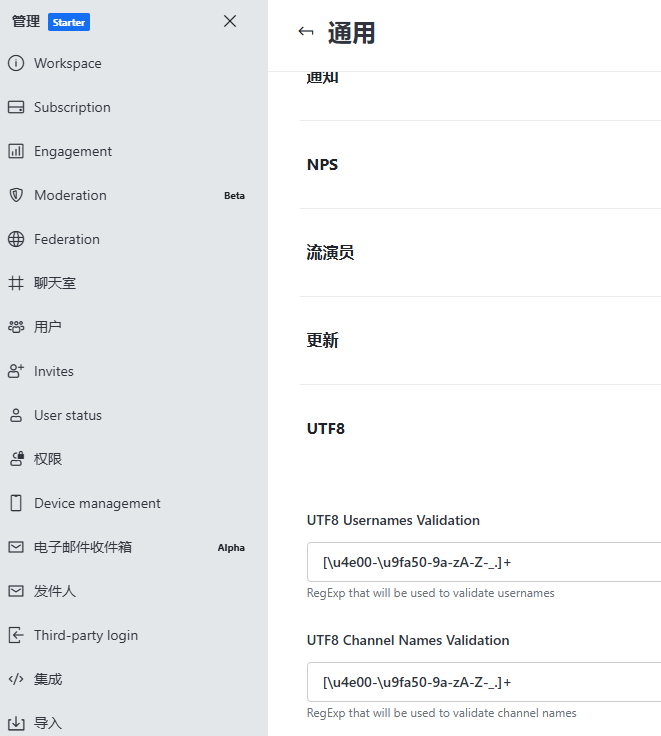

### Create Webhook

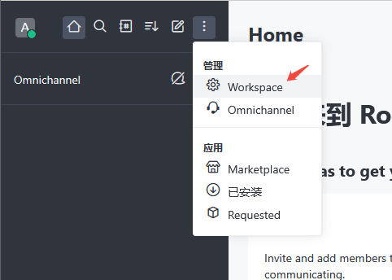

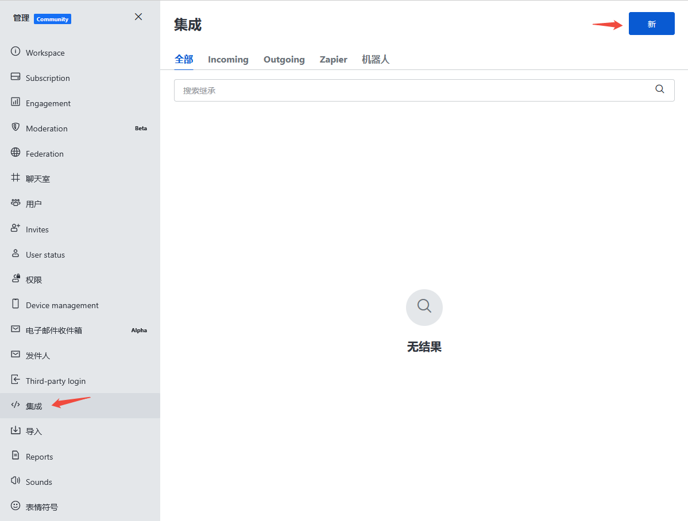

Note: The channel must be created in advance. If using another user as the webhook sender, that user must also exist. Enable `Allow to overwrite destination channel in the body parameters` so messages can be sent to specified channels or users via parameters.

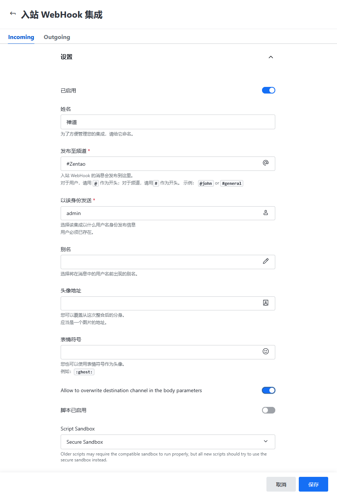

After saving, this webhook can be used. Note that the IP in the URL should be the host's IP, not 127.0.0.1, because requests from the Zentao container to the RocketChat server cannot reach 127.0.0.1.

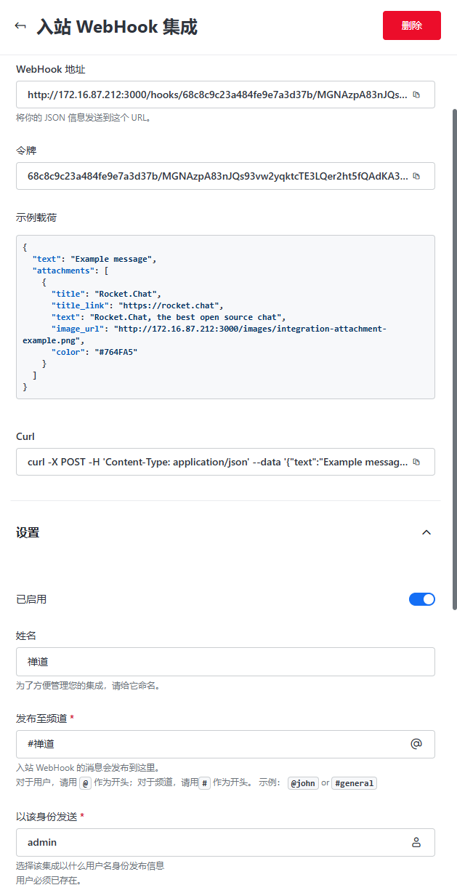

You can test directly using the provided example:

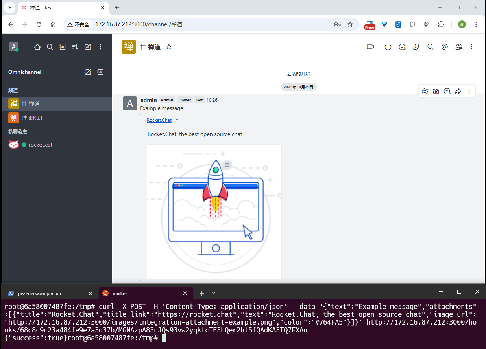


## 3. Modify Zentao

Now, our goal is to integrate RocketChat Webhook into Zentao.

### 3.1. Modify Zentao Webhook Module

#### 3.1.1. Edit `webhook\config\formdata.php`

Add after `$config->webhook->form->create['feishuAppSecret']`:
```php
$config->webhook->form->create['rocketChannel']    = array('type' => 'string', 'control' => 'text',      'required' => false, 'default' => '', 'filter'  => 'trim');
```

Add after `$config->webhook->form->edit['feishuAppSecret']`:

```php
$config->webhook->form->edit['rocketChannel']    = array('type' => 'string', 'control' => 'text',      'required' => false, 'default' => '', 'filter'  => 'trim');
```

#### 3.1.2. Edit `webhook\js\create.js`

Change the following code
```js
    $('#type').change(function()
    {
        var type = $(this).val();
        $('#sendTypeTR').toggle(type != 'dinggroup' && type != 'dinguser' && type != 'wechatuser' && type != 'wechatgroup' && type != 'feishuuser' && type != 'feishugroup');
        $('#secretTR').toggle(type == 'dinggroup' || type == 'feishugroup');
        $('#urlTR').toggle(type != 'dinguser' && type != 'wechatuser' && type != 'feishuuser');
        $('.dinguserTR').toggle(type == 'dinguser');
        $('.wechatTR').toggle(type == 'wechatuser');
        $('.feishuTR').toggle(type == 'feishuuser');
        $('#paramsTR').toggle(type != 'bearychat' && type != 'dinggroup' && type != 'dinguser' && type != 'wechatuser' && type != 'wechatgroup' && type != 'feishuuser' && type != 'feishugroup');
        $('#urlNote').html(urlNote[type]);
    });
```

to (add `rocketchannel`):
```js
    $('#type').change(function()
    {
        var type = $(this).val();
        $('#sendTypeTR').toggle(type != 'dinggroup' && type != 'dinguser' && type != 'wechatuser' && type != 'wechatgroup' && type != 'feishuuser' && type != 'feishugroup' && type != 'rocketchannel');
        $('#secretTR').toggle(type == 'dinggroup' || type == 'feishugroup');
        $('#urlTR').toggle(type != 'dinguser' && type != 'wechatuser' && type != 'feishuuser');
        $('.dinguserTR').toggle(type == 'dinguser');
        $('.wechatTR').toggle(type == 'wechatuser');
        $('.feishuTR').toggle(type == 'feishuuser');
		$('.rocketTR').toggle(type == 'rocketchannel');
        $('#paramsTR').toggle(type != 'bearychat' && type != 'dinggroup' && type != 'dinguser' && type != 'wechatuser' && type != 'wechatgroup' && type != 'feishuuser' && type != 'feishugroup' && type != 'rocketchannel');
        $('#urlNote').html(urlNote[type]);
    });
```

#### 3.1.3. Edit `webhook\js\create.ui.js`

Change the code to (add `rocketchannel`):
```js
window.changeType = function()
{
    var type = $('[name=type]').val();
    $('#sendTypeTR').toggle(type != 'dinggroup' && type != 'dinguser' && type != 'wechatuser' && type != 'wechatgroup' && type != 'feishuuser' && type != 'feishugroup' && type != 'rocketchannel');
    $('#secretTR').toggle(type == 'dinggroup' || type == 'feishugroup');
    $('#urlTR').toggle(type != 'dinguser' && type != 'wechatuser' && type != 'feishuuser');
    $('.dinguserTR').toggle(type == 'dinguser');
    $('.wechatTR').toggle(type == 'wechatuser');
    $('.feishuTR').toggle(type == 'feishuuser');
	$('.rocketTR').toggle(type == 'rocketchannel');
    $('#paramsTR').toggle(type != 'bearychat' && type != 'dinggroup' && type != 'dinguser' && type != 'wechatuser' && type != 'wechatgroup' && type != 'feishuuser' && type != 'feishugroup' && type != 'rocketchannel');
    $('#urlNote').html(urlNote[type]);
}
changeType();
```

#### 3.1.4. Edit `webhook\lang\zh-cn.php`

Add:

```php
$lang->webhook->typeList['rocketchannel'] = 'RocketChat Channel';
$lang->webhook->rocketChannel = 'RocketChat Channel';
$lang->webhook->note->rocketChannel = 'Enter RocketChat channel name(s) without #, separated by commas.';
$lang->webhook->note->typeList['rocketchannel'] = 'Add an integration in RocketChat and enter its webhook here.';
```

Add other languages as needed.

#### 3.1.5. Edit `webhook\ui\create.html.php`

Above the line `$formItems[] = formRow`, add:

```php
    if($field == 'rocketChannel') {
        $title = $lang->webhook->rocketChannel;
        $rowClass = 'rocketTR';
        $required = true;
        $notice = $lang->webhook->note->rocketChannel;
    }
```

#### 3.1.6. Edit `webhook\ui\edit.html.php`

Modify the line `if($field == 'params'` to add `rocketchannel` condition:

```php
if($field == 'params' && str_contains('|bearychat|dinggroup|dinguser|wechatgroup|wechatuser|feishuuser|feishugroup|rocketchannel|', "|{$webhook->type}|")) continue;
```

Above the line `$formItems[] = formRow`, add:

```php
    if($field == 'rocketChannel') {
        $title = $lang->webhook->rocketChannel;
        $rowClass = 'rocketTR';
        $required = true;
        $notice = $lang->webhook->note->rocketChannel;
        $default = $webhook->params;
    }
```

#### 3.1.7. Edit `webhook\view\create.html.php`

Add the `rocketTR` section:

```php
        <tr class='feishuTR'>
          <th><?php echo $lang->webhook->feishuAppSecret;?></th>
          <td class='required'><?php echo html::input('feishuAppSecret', '', "class='form-control'");?></td>
        </tr>
        <tr class="rocketTR">
          <th><?php echo $lang->webhook->rocketChannel;?></th>
          <td class='required'><?php echo html::input('rocketChannel', '', "class='form-control'")?></td>
          <td id='rocketNote'><?php echo $lang->webhook->note->rocketChannel ?></td>
        </tr>
```

#### 3.1.8. Edit `webhook\view\edit.html.php`

After the `feishuuser` related code, add the `rocketchannel` section:

```php
        <?php if($webhook->type == 'feishuuser'):?>
        <?php $secret = json_decode($webhook->secret);?>
        <tr class="feishuTR">
          <th><?php echo $lang->webhook->feishuAppId;?></th>
          <td class='required'><?php echo html::input('feishuAppId', $secret->appId, "class='form-control'")?></td>
        </tr>
        <tr class="feishuTR">
          <th><?php echo $lang->webhook->feishuAppSecret;?></th>
          <td class='required'><?php echo html::input('feishuAppSecret', $secret->appSecret, "class='form-control'")?></td>
          <td></td>
        </tr>
        <?php endif;?>
        <?php if($webhook->type == 'rocketchannel'):?>
        <tr class="rocketTR">
          <th><?php echo $lang->webhook->rocketChannel;?></th>
          <td><?php echo html::input('rocketChannel', $webhook->params, "class='form-control'")?></td>
          <td><?php echo $lang->webhook->note->rocketChannel ?></td>
        </tr>
        <?php endif;?>
```

Find two places with `if(strpos(` and add `rocketchannel` condition:

```php
<?php if(strpos("dinggroup|dinguser|wechatgroup|wechatuser|feishuuser|feishugroup|rocketchannel", $webhook->type) === false):?>
```

```php
<?php if(strpos(',bearychat,dinggroup,dinguser,wechatgroup,wechatuser,feishuuser,feishugroup,rocketchannel,', ",$webhook->type,") === false):?>
```


#### 3.1.9. Edit `webhook\model.php`

##### Edit `public function create($webhook)`:

```php
    public function create($webhook)
    {
        $webhook->createdBy   = $this->app->user->account;
        $webhook->createdDate = helper::now();
        $webhook->domain      = trim($webhook->domain, '/');
        $webhook->params      = $this->post->params ? implode(',', $this->post->params) . ',text' : 'text';

        if($webhook->type == 'dinguser')
        {
            $webhook = $this->webhookTao->getDingdingSecret($webhook);
        }
        elseif($webhook->type == 'wechatuser')
        {
            $webhook = $this->webhookTao->getWeixinSecret($webhook);
        }
        elseif($webhook->type == 'feishuuser')
        {
            $webhook = $this->webhookTao->getFeishuSecret($webhook);
        }
        elseif($webhook->type == 'rocketchannel')
        {
            $webhook->params = $webhook->rocketChannel;
        }

        if(dao::isError()) return false;

        $this->dao->insert(TABLE_WEBHOOK)->data($webhook, 'agentId,appKey,appSecret,wechatCorpId,wechatCorpSecret,wechatAgentId,feishuAppId,feishuAppSecret,rocketChannel')
            ->batchCheck($this->config->webhook->create->requiredFields, 'notempty')
            ->autoCheck()
            ->exec();

        return $this->dao->lastInsertID();
    }
```

##### Edit `public function update($id, $webhook)`:

```php
    public function update($id, $webhook)
    {
        $webhook->editedBy   = $this->app->user->account;
        $webhook->editedDate = helper::now();
        $webhook->domain     = trim($webhook->domain, '/');
        $webhook->params     = $this->post->params ? implode(',', $this->post->params) : 'text';
        if(!str_contains($webhook->params, 'text')) $webhook->params .= ',text';

        if($webhook->type == 'dinguser')
        {
            $webhook = $this->webhookTao->getDingdingSecret($webhook);
        }
        elseif($webhook->type == 'wechatuser')
        {
            $webhook = $this->webhookTao->getWeixinSecret($webhook);
        }
        elseif($webhook->type == 'feishuuser')
        {
            $webhook = $this->webhookTao->getFeishuSecret($webhook);
        }
        elseif($webhook->type == 'rocketchannel')
        {
            $webhook->params = $webhook->rocketChannel;
        }

        $this->dao->update(TABLE_WEBHOOK)->data($webhook, 'agentId,appKey,appSecret,wechatCorpId,wechatCorpSecret,wechatAgentId,feishuAppId,feishuAppSecret,rocketChannel')
            ->batchCheck($this->config->webhook->edit->requiredFields, 'notempty')
            ->autoCheck()
            ->where('id')->eq($id)
            ->exec();
        return !dao::isError();
    }
```

##### Edit `public function getDataByType($webhook, $action, $title, $text, $mobile, $email, $objectType, $objectID)`:

```php
    public function getDataByType($webhook, $action, $title, $text, $mobile, $email, $objectType, $objectID)
    {
        if($webhook->type == 'dinggroup' or $webhook->type == 'dinguser')
        {
            $data = $this->getDingdingData($title, $text, $webhook->type == 'dinguser' ? '' : $mobile);
        }
        elseif($webhook->type == 'bearychat')
        {
            $data = $this->getBearychatData($text, $mobile, $email, $objectType, $objectID);
        }
        elseif($webhook->type == 'wechatgroup' or $webhook->type == 'wechatuser')
        {
            $data = $this->getWeixinData($text, $mobile);
        }
        elseif($webhook->type == 'feishuuser' or $webhook->type == 'feishugroup')
        {
            $data = $this->getFeishuData($title, $text);
        }
        elseif($webhook->type == 'rocketchannel') {
            $data = new stdclass();
            $data->text = $text;
            $data->channel = $webhook->params;
        }
        else
        {
            $data = new stdclass();
            foreach(explode(',', $webhook->params) as $param) $data->$param = $action->$param;
        }

        return json_encode($data);
    }
```

##### Edit `public function fetchHook($webhook, $sendData, $actionID = 0, $appendUser = '')`:

```php
    public function fetchHook($webhook, $sendData, $actionID = 0, $appendUser = '')
    {
        if(!extension_loaded('curl')) return print(helper::jsonEncode($this->lang->webhook->error->curl));

        if(in_array($webhook->type, array('dinguser', 'wechatuser', 'feishuuser'))) return $this->sendToUser($webhook, $sendData, $actionID, $appendUser);

        $contentType = "Content-Type: {$webhook->contentType};charset=utf-8";
        if($webhook->type == 'dinggroup' or $webhook->type == 'wechatgroup' or $webhook->type == 'feishugroup' or $webhook->type == 'rocketchannel') $contentType = "Content-Type: application/json";
        $header[] = $contentType;

        $url = $webhook->url;
        if($webhook->type == 'dinggroup' and $webhook->secret)
        {
            $timestamp = time() * 1000;
            $sign = $timestamp . "\n" . $webhook->secret;
            $sign = urlencode(base64_encode(hash_hmac('sha256', $sign, $webhook->secret, true)));
            $url .= "&timestamp={$timestamp}&sign={$sign}";
        }
        if($webhook->type == 'feishugroup' and $webhook->secret)
        {
            $timestamp = time();
            $sign = $timestamp . "\n" . $webhook->secret;
            $sign = base64_encode(hash_hmac('sha256', '', $sign, true));

            $content = json_decode($sendData);
            $content->timestamp = $timestamp;
            $content->sign      = $sign;
            $sendData = json_encode($content);
        }

        // Special handling for rocketchannel: send to multiple channels if needed
        if($webhook->type == 'rocketchannel') {
            $ch = $this->curlInit($url, $header);
        
            $tmpdata = json_decode($sendData);

            if(strlen($tmpdata->channel) > 0) {
                if(stripos($tmpdata->channel, ",") > 0) {
                    $channels = explode(",", $tmpdata->channel);
                } else {
                    $channels = array($tmpdata->channel);
                }
                foreach($channels as $channel) {
                    $tmpdata->channel = trim($channel);
                    $data = json_encode($tmpdata);

                    curl_setopt($ch, CURLOPT_POSTFIELDS, $data);

                    $result   = curl_exec($ch);
                    $httpCode = curl_getinfo($ch, CURLINFO_HTTP_CODE);
                    $error    = curl_error($ch);
                    curl_close($ch);
                    if($error)  return $error;
                }
            }

            if($result) return $result;
            return $httpCode;
        } else {
            $ch = $this->curlInit($url, $header);
            curl_setopt($ch, CURLOPT_POSTFIELDS, $sendData);

            $result   = curl_exec($ch);
            $httpCode = curl_getinfo($ch, CURLINFO_HTTP_CODE);
            $error    = curl_error($ch);
            curl_close($ch);

            if($error)  return $error;
            if($result) return $result;
            return $httpCode;
        }
    }

    private function curlInit($url, $header = array()) {
        $ch = curl_init();
        curl_setopt($ch, CURLOPT_URL, $url);
        curl_setopt($ch, CURLOPT_POST, 1);
        curl_setopt($ch, CURLOPT_CONNECTTIMEOUT, 30);
        curl_setopt($ch, CURLOPT_TIMEOUT, 30);
        curl_setopt($ch, CURLOPT_NOSIGNAL, 1);
        curl_setopt($ch, CURLOPT_HTTPHEADER, $header);
        curl_setopt($ch, CURLOPT_RETURNTRANSFER, 1);
        curl_setopt($ch, CURLOPT_SSL_VERIFYHOST, 0);
        curl_setopt($ch, CURLOPT_SSL_VERIFYPEER, 0);
        return $ch;
    }
```


### 3.2. Add RocketChat Webhook to Zentao

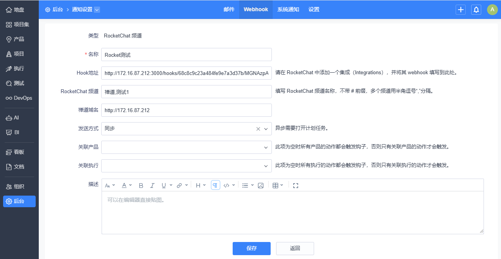

Then, find any bug or task and add a comment:

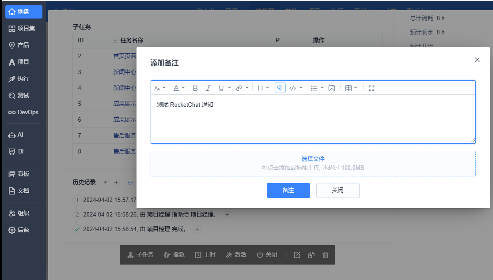

You will receive the notification in the configured RocketChat channel:

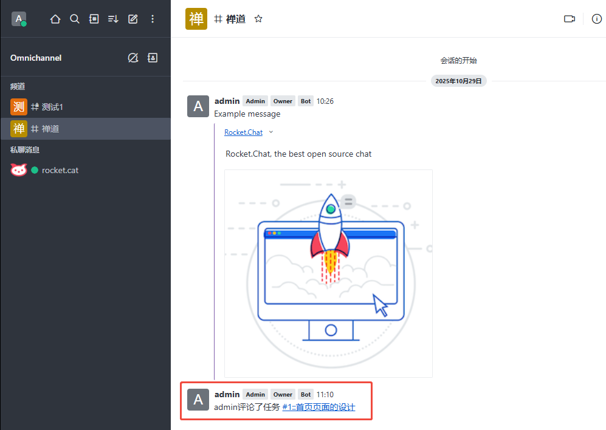

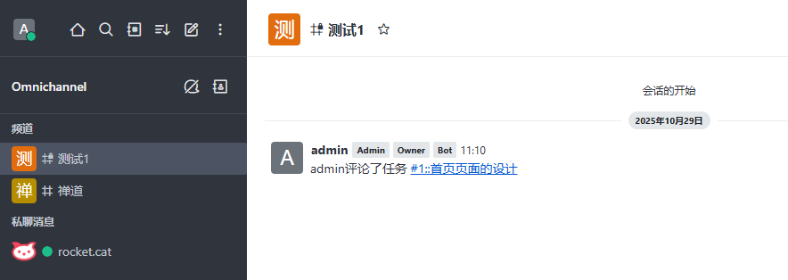


## 4. Direct Notification to Users

Notifying only channels is similar to group notifications in WeCom or DingTalk. For large teams, direct user notifications are preferable to avoid spamming everyone. Therefore, we refer to the user binding approach of WeCom and DingTalk to bind RocketChat and Zentao accounts.

For security, create a dedicated user (e.g., `zentao`) in RocketChat for sending messages.

### 4.1. Add a `zentao` User in RocketChat

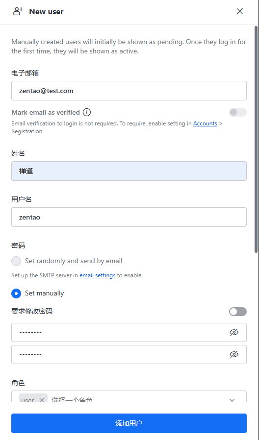

### 4.2. Update RocketChat Webhook Configuration

Use the `zentao` user to send messages:

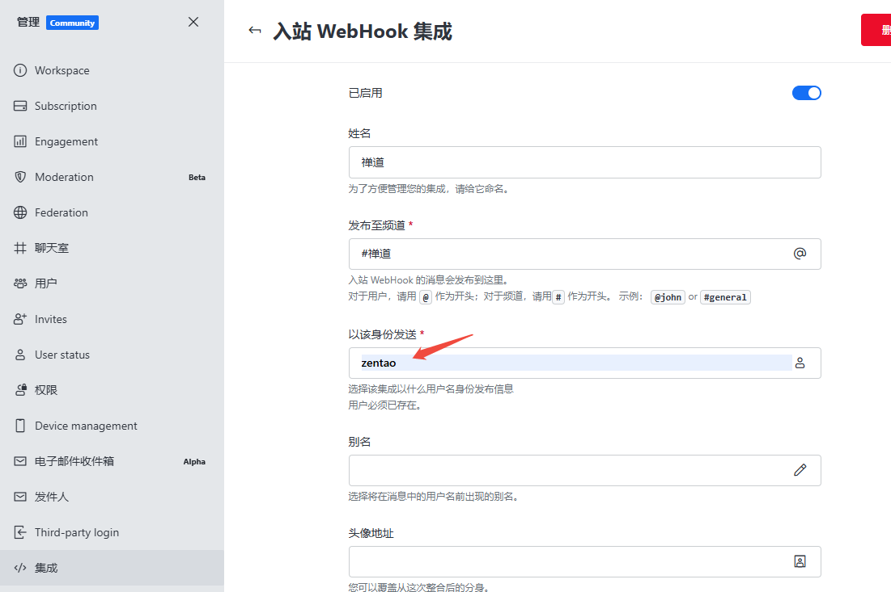

### 4.3. Obtain RocketChat User API Token


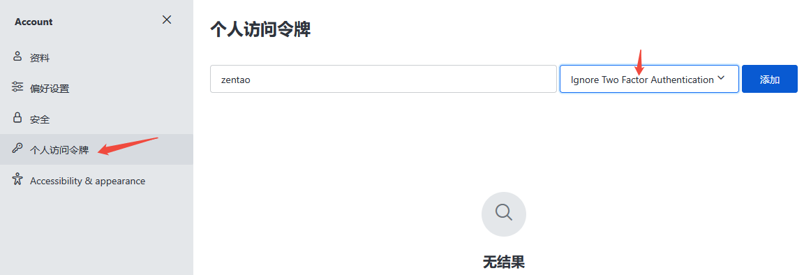

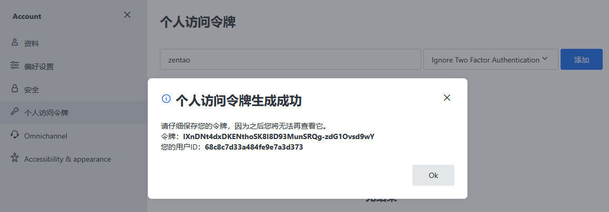

The API to use: https://developer.rocket.chat/apidocs/get-users-list

Test if the token is available:

```
curl -H 'X-Auth-Token: z6pD9UOCSWJ83lnMMO4ZqzuN4IaKh-I2b0NMZPyvoCB' -H 'X-User-Id: PF2faXWRNfTZbJqY5' 'http://127.0.0.1:3000/api/v1/users.info?userId=zentao'

# Returns:
{"user":{"_id":"PF2faXWRNfTZbJqY5","username":"zentao","type":"user","status":"away","active":true,"name":"禅道","utcOffset":8,"canViewAllInfo":false},"success":true}%
```

```
curl -H 'X-Auth-Token: z6pD9UOCSWJ83lnMMO4ZqzuN4IaKh-I2b0NMZPyvoCB' -H 'X-User-Id: PF2faXWRNfTZbJqY5' 'http://127.0.0.1:3000/api/v1/users.list'

# Returns:
{"users":[{"_id":"693048466f442bace501954a","name":"Admin","username":"admin","status":"offline","active":true,"type":"user","nameInsensitive":"admin"},{"_id":"rocket.cat","name":"Rocket.Cat","username":"rocket.cat","status":"online","active":true,"type":"bot","avatarETag":"KMQbXSF5e5AaH3LK4","nameInsensitive":"rocket.cat"},{"_id":"PF2faXWRNfTZbJqY5","username":"zentao","type":"user","status":"away","active":true,"name":"禅道","nameInsensitive":"禅道"}],"count":3,"offset":0,"total":3,"success":true}
```

### 4.4. Modify Zentao Code

The specific code is reflected in the project and not listed here in detail.

- Added rocketchatapi.class.php for RocketChat API integration;
- In control.php, handled the `rocketchannel` type webhook;
- In model.php, added support for `rocketchannel` type webhook and `sendToUser` call;
- In tao.php, added `getRocketChatSecret` for obtaining RocketChat authentication and API URL;
- In zen.php, updated `getResponse` to handle `rocketchannel` logic for sending messages to specified users.


### 4.5. Testing

In Zentao's Webhook UI, click the link icon in the operation column of the previously created Hook entry:

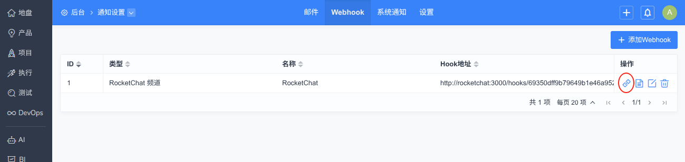

You can bind existing Zentao users and RocketChat users:

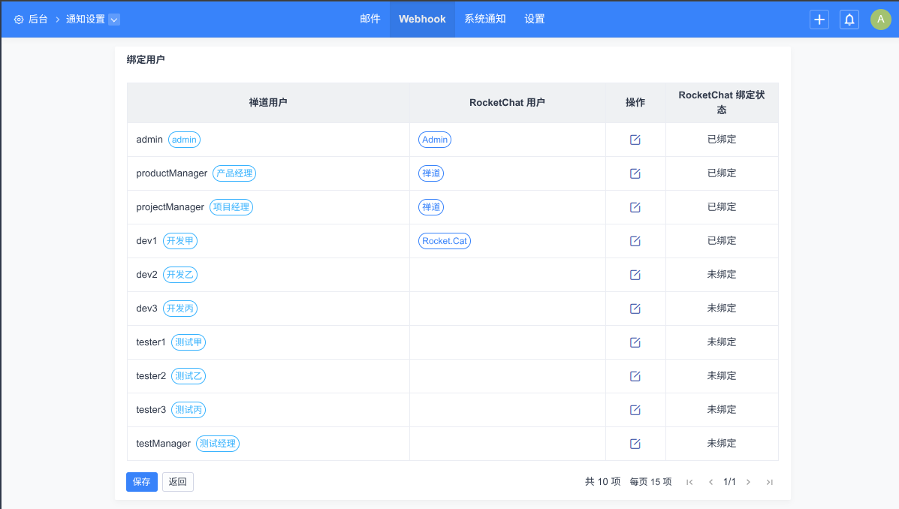

Then, find any bug or task, add a comment, and check if it can be sent to the specified user:

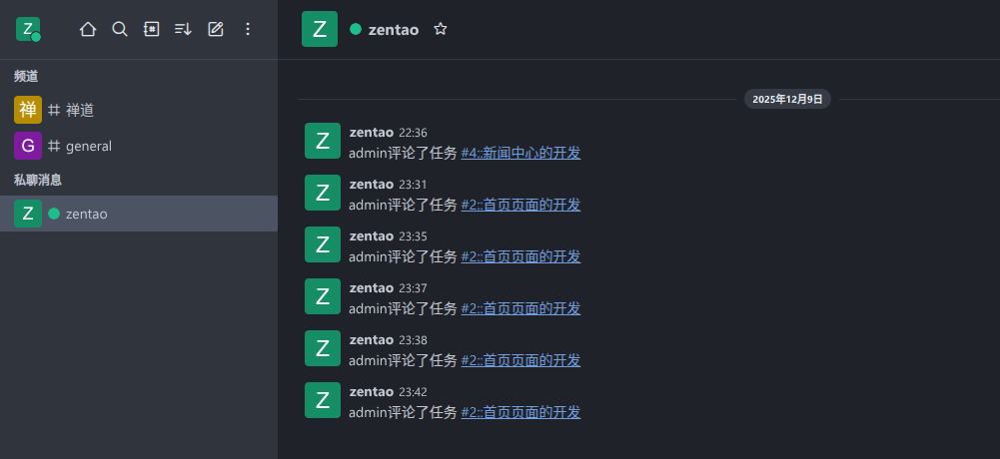


## 5. Summary

By following these steps, Zentao and RocketChat are successfully integrated. When creating tasks or bugs in Zentao, messages are automatically sent to specified RocketChat channels or users. This allows you to receive real-time updates from Zentao in RocketChat, improving team collaboration efficiency.

